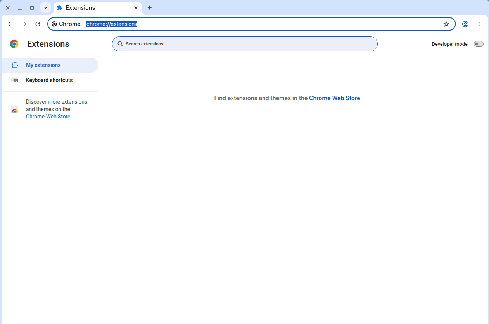
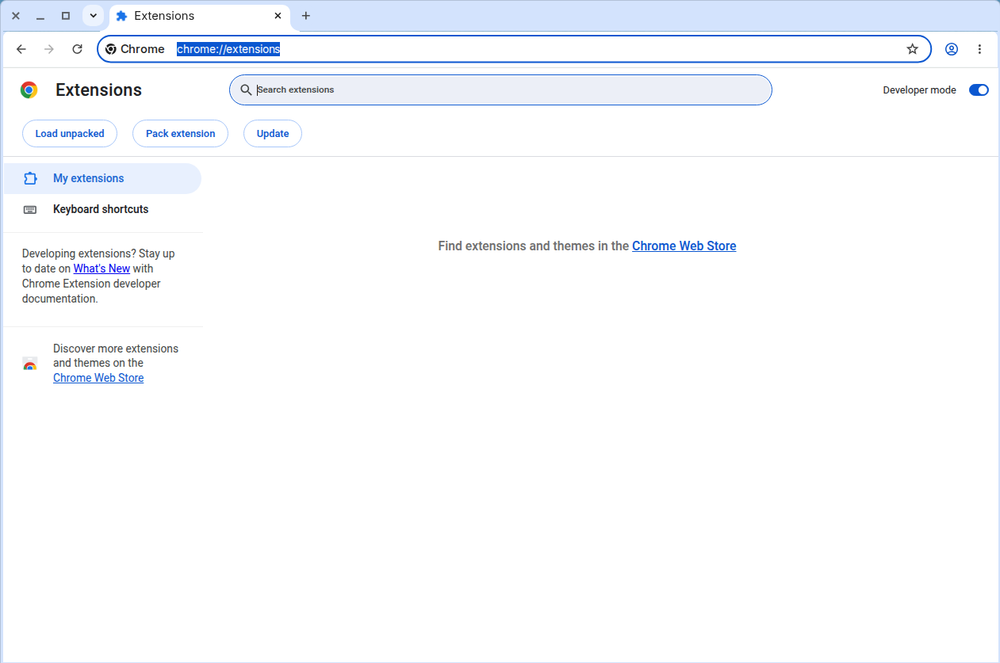
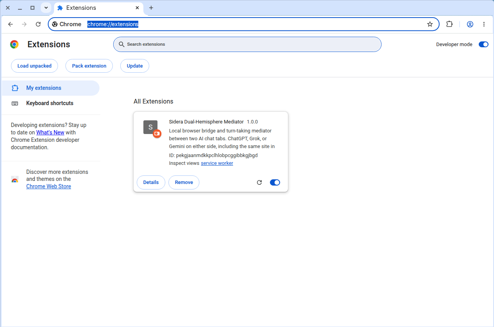

# Install Sidera, step by step

Two stages: run the installer, then load the extension into Google Chrome once.
The second stage is needed because current Google Chrome (version 137 and
later) no longer lets a program load an extension for you; it must be loaded
once by hand. It stays in Chrome afterwards — this is a one-time step, and it
is free. (Microsoft Edge, Brave, Vivaldi, and Opera load the extension
automatically when Sidera opens them, so on those browsers you can skip
stage 2.)

About the pictures: the screenshots for steps 1, 2 and 6 of stage 2 are real
captures of Google Chrome. The other steps are marked **[screenshot pending]**.
Real Windows captures for them will be added after the first live install on
a Windows PC. Until then, follow the text for those steps; it gives the exact
buttons and the exact folder.

## Stage 1: run the installer

> **[screenshot pending]** No picture of the installer window yet.

1. Double-click `INSTALL.bat` in the Sidera folder you downloaded.
2. Answer the one question about a desktop icon.

That copies Sidera to `C:\Sidera`, installs Python if needed, and registers
the connection between the browser and the Sidera program. If Windows asks
whether to allow the installer, choose Yes. When it finishes, the installer
opens this guide in your web browser.

## Stage 2: load the extension into Chrome (once)

### 1. Open the Extensions page

Open Google Chrome. Click in the address bar at the top, type exactly:

```text
chrome://extensions
```

and press Enter. This page opens:



### 2. Turn on Developer mode

Find the **Developer mode** switch in the top-right corner of the page and
click it so it turns blue. Three new buttons appear at the top left, including
**Load unpacked**. Developer mode can stay on; it only means "allow loading an
extension from a folder".



### 3. Click "Load unpacked"

Click the **Load unpacked** button at the top left. A Windows folder window
opens, asking you to pick a folder.

> **[screenshot pending (Windows)]** No picture of the Windows folder window
> yet.

### 4. Go to the Sidera extension folder

The folder to pick is exactly:

```text
C:\Sidera\chrome-extension
```

In the folder window, click in the address bar at the top (the bar that shows
the current folder path), type or paste `C:\Sidera\chrome-extension`, and
press Enter. The window now shows the inside of that folder: files such as
`manifest.json` and `background.js`, and an `adapters` folder.

> **[screenshot pending (Windows)]** No picture of the folder window with
> `C:\Sidera\chrome-extension` open yet.

### 5. Confirm with "Select Folder"

Click **Select Folder** at the bottom right of the window. The folder to pick
is the `chrome-extension` folder itself — the folder that directly contains
the file `manifest.json` — not the `C:\Sidera` folder above it and not any
folder inside it.

> **[screenshot pending]** No picture of this step yet.

### 6. Check the Sidera card

The Sidera Dual-Hemisphere Mediator card appears on the Extensions page.
Under its description it shows an ID. Check that the ID reads exactly:

```text
pekgjaanmdkkpclhlobpcggibbkgjbgd
```



(The screenshot was taken with an earlier build, so its card says version
1.0.0. Your card shows the current version, 1.1.0. The ID is the same.)

The Sidera program on your PC only talks to the extension with this ID. The
ID is built into the extension itself, so it is the same whichever folder the
extension is loaded from. Still, load it from `C:\Sidera\chrome-extension`:
that is the copy `INSTALL.bat` keeps up to date, so a later update reaches
Chrome (after you click the card's reload arrow or restart Chrome).

### 7. Done — start Sidera

Close the Extensions page. From now on, start Sidera by double-clicking the
**Sidera Mediator** icon (desktop or Start menu). It opens ChatGPT and Grok,
each in its own window. Click the puzzle-piece icon to the right of Chrome's
address bar and pin **Sidera Dual-Hemisphere Mediator** so its button is
always visible, then click that button to open the control popup.

> **[screenshot pending]** No picture of the popup opened from Chrome's
> toolbar yet.

In the popup, pick the AI and the tab for each side, pair LEFT and RIGHT, and
press **Start Exchange**. If the popup says **Not running**, the Sidera
program has not been started yet: double-click the **Sidera Mediator** icon.

## If it doesn't show up

- **No card appears, or Chrome says "Manifest file is missing or
  unreadable".** The wrong folder was picked. Repeat step 3 and choose
  `C:\Sidera\chrome-extension` itself — the folder that directly contains
  `manifest.json` — not `C:\Sidera` and not a folder inside `chrome-extension`.
- **It was loaded from the downloaded folder instead of `C:\Sidera`.** It
  works (the ID is the same), but later updates installed with `INSTALL.bat`
  will not reach Chrome. Click **Remove** on the card and load
  `C:\Sidera\chrome-extension` instead.
- **The popup says "Sidera program: Not running — open Sidera from its
  icon".** The extension is fine; the Sidera program is not running. Close the
  popup and double-click the **Sidera Mediator** icon. If that never helps,
  run `INSTALL.bat` again and restart Chrome.
- **The card is there but the Sidera button is nowhere in the toolbar.**
  Click the puzzle-piece icon to the right of the address bar; Sidera is in
  that list. Click the pin next to it.
- **The extension disappeared after Chrome restarted.** Chrome was probably
  opened with a different profile (a different person icon in the top-right
  corner). Switch to the profile where Sidera was loaded, or load it in the
  current profile the same way.
- **Chrome shows a bubble about developer-mode extensions on startup.** That
  is normal for any extension loaded from a folder. Nothing needs to be done.
