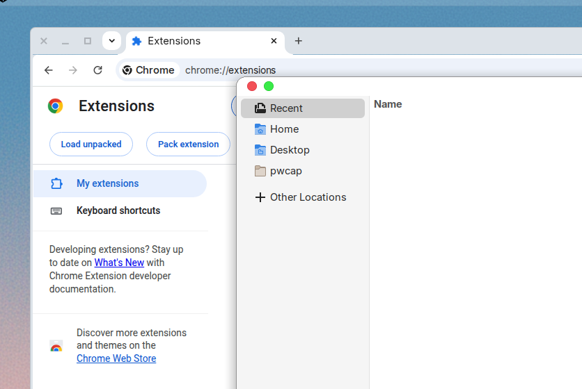
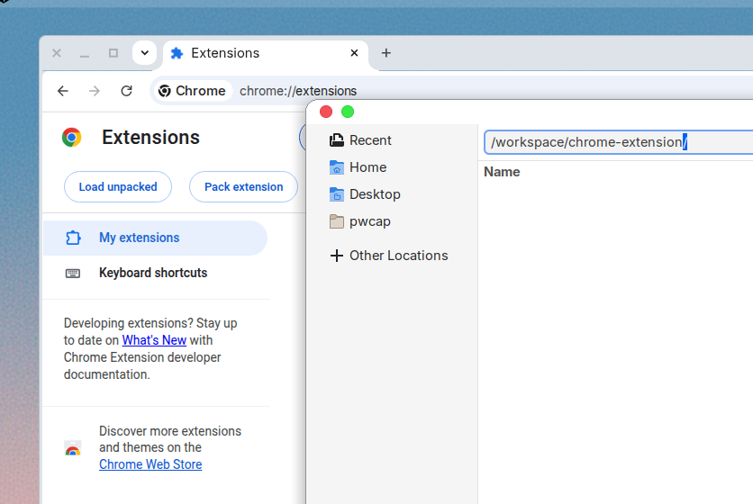
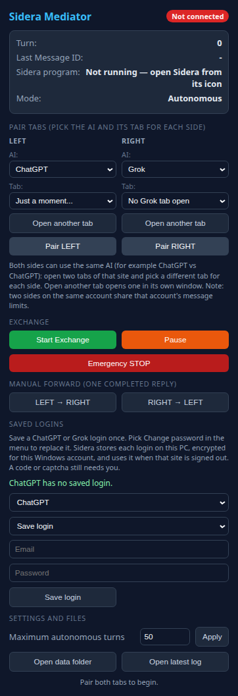

# Install Sidera, step by step

Two stages: run the installer, then load the extension into Google Chrome once.
The second stage is needed because current Google Chrome (version 137 and
later) no longer lets a program load an extension for you; it must be loaded
once by hand. It stays in Chrome afterwards — this is a one-time step, and it
is free. (Microsoft Edge, Brave, Vivaldi, and Opera load the extension
automatically when Sidera opens them, so on those browsers you can skip
stage 2.)

The screenshots below are real captures of Google Chrome. They were taken on a
test machine, so the folder picker in steps 4–5 has a plain look; on your
Windows PC the same picker is the familiar Windows Explorer window.

## Stage 1: run the installer

1. Double-click `INSTALL.bat` in the Sidera folder you downloaded.
2. Answer the one question about a desktop icon.

That copies Sidera to `C:\Sidera`, installs Python if needed, and registers
the connection between the browser and the Sidera program. If Windows asks
whether to allow the installer, choose Yes.

## Stage 2: load the extension into Chrome (once)

### 1. Open the Extensions page

Open Google Chrome. Click in the address bar at the top, type exactly:

```text
chrome://extensions
```

and press Enter. This page opens:


### 2. Turn on Developer mode

Find the **Developer mode** switch in the top-right corner of the page and
click it so it turns blue. Three new buttons appear at the top left, including
**Load unpacked**. Developer mode can stay on; it only means "allow loading an
extension from a folder".


### 3. Click "Load unpacked"

Click the **Load unpacked** button at the top left. A window opens asking you
to pick a folder:



### 4. Pick the Sidera extension folder

In that window, go to this exact folder (you can type or paste the path into
the window's address/location bar):

```text
C:\Sidera\chrome-extension
```



### 5. Confirm with "Select Folder"

Click **Select Folder**. Pick the `chrome-extension` folder itself — the
folder that directly contains the file `manifest.json` — not the `C:\Sidera`
folder above it and not any folder inside it.

### 6. Check the Sidera card

The Sidera Dual-Hemisphere Mediator card appears on the Extensions page.
Under its description it shows an ID. Check that the ID reads exactly:

```text
pekgjaanmdkkpclhlobpcggibbkgjbgd
```


That ID must match, because the Sidera program on your PC only talks to this
exact extension. Loading from `C:\Sidera\chrome-extension` always produces
this ID; a copy of the folder somewhere else produces a different ID and will
not connect.

### 7. Done — start Sidera

Close the Extensions page. From now on, start Sidera by double-clicking the
**Sidera Mediator** icon (desktop or Start menu). It opens ChatGPT and Grok,
each in its own window. Click the puzzle-piece icon to the right of Chrome's
address bar and pin **Sidera Dual-Hemisphere Mediator** so its button is
always visible, then click that button to open the control popup:



Pick the AI and the tab for each side, pair LEFT and RIGHT, and press
**Start Exchange**. (The screenshot above was taken before the Sidera program
was started, which is why it says "Not running".)

## If it doesn't show up

- **No card appears, or Chrome says "Manifest file is missing or
  unreadable".** The wrong folder was picked. Repeat step 3 and choose
  `C:\Sidera\chrome-extension` itself — the folder that directly contains
  `manifest.json` — not `C:\Sidera` and not a folder inside `chrome-extension`.
- **The ID is different from `pekgjaanmdkkpclhlobpcggibbkgjbgd`.** The folder
  was loaded from somewhere other than `C:\Sidera\chrome-extension` (for
  example from the downloaded copy). Click **Remove** on the card and load it
  again from `C:\Sidera\chrome-extension`. Run `INSTALL.bat` first if that
  folder does not exist.
- **The popup says "Sidera program: Not running — open Sidera from its
  icon".** The extension is fine; the Sidera program is not running. Close the
  popup and double-click the **Sidera Mediator** icon. If that never helps,
  run `INSTALL.bat` again and restart Chrome.
- **The card is there but the Sidera button is nowhere in the toolbar.**
  Click the puzzle-piece icon to the right of the address bar; Sidera is in
  that list. Click the pin next to it.
- **The extension disappeared after Chrome restarted.** Chrome was probably
  opened with a different profile (a different person icon in the top-right
  corner). Switch to the profile where Sidera was loaded, or load it in the
  current profile the same way.
- **Chrome shows a bubble about developer-mode extensions on startup.** That
  is normal for any extension loaded from a folder. Nothing needs to be done.
